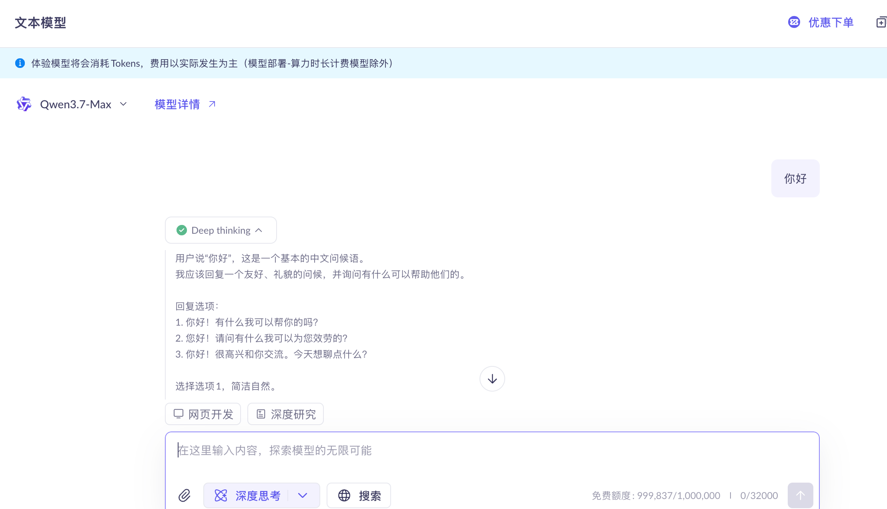
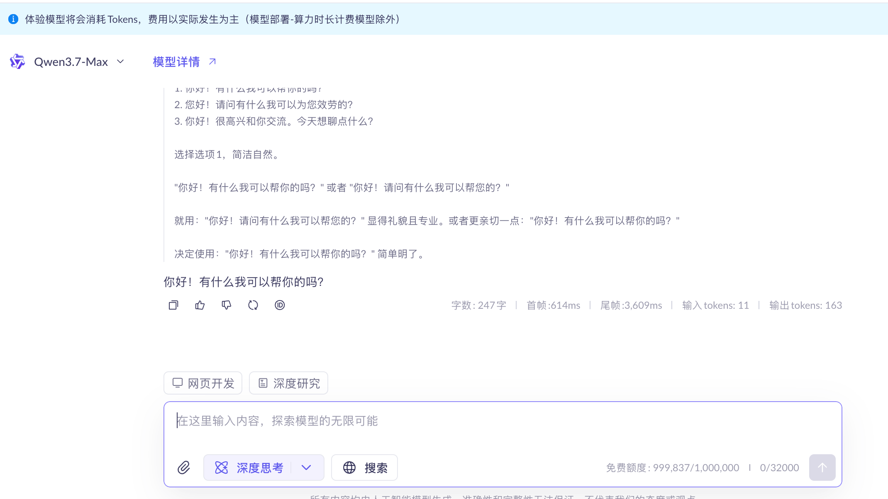

1、用户登录，只要输入用户名即可登录
2、用户可以在登录后，与Yumi进行对话

界面设计参考图片

## 前端
前端代码写在 /Users/liyong/IdeaProjects/hello-word/l7_Yumi/src/frontend
前端使用Vue+vite+ElementPlus

## 后端
后端代码写在 /Users/liyong/IdeaProjects/hello-word/l7_Yumi/src/main/java/yumi
前端请求代码写在mvc包下

