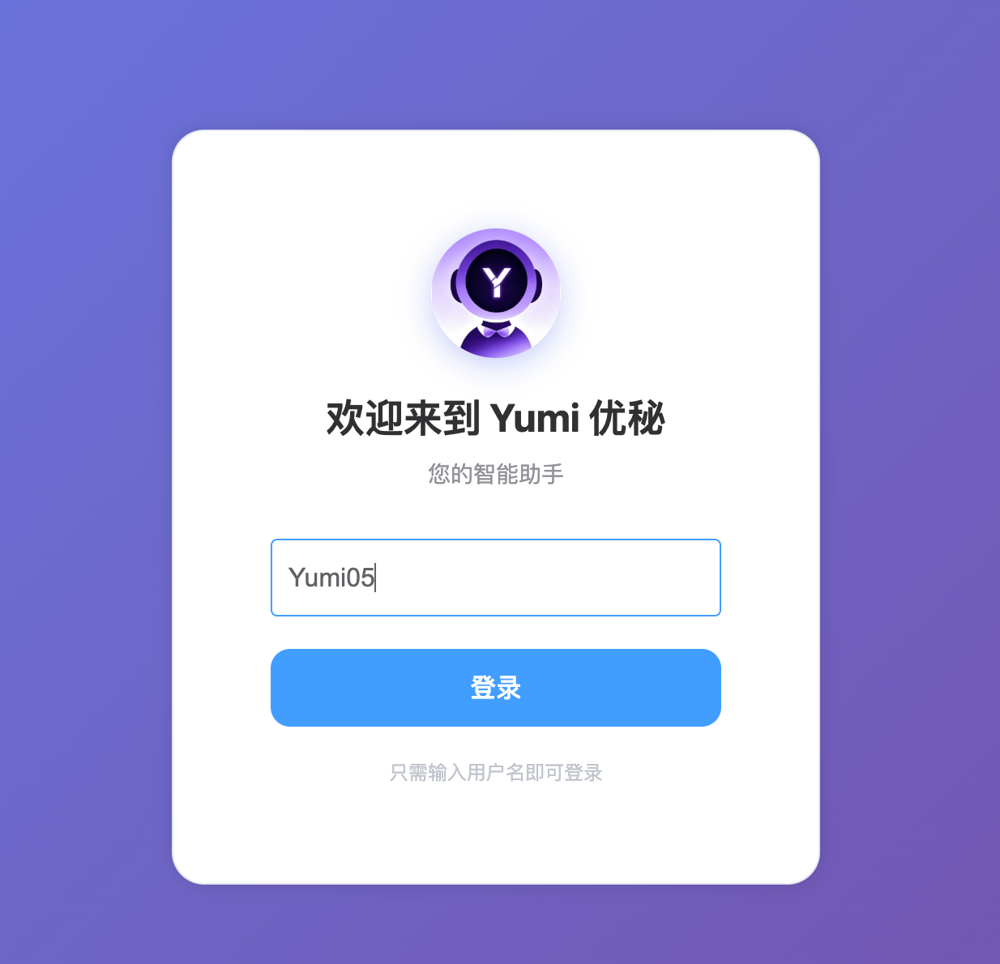
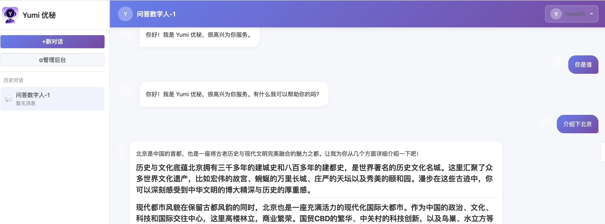

# Yumi 功能概览

## 1. 用户登录

用户通过用户名和密码登录系统，登录后生成会话 ID 并跳转到对话页面。

### 功能说明
- 支持用户名密码登录
- 登录后自动生成用户会话 ID
- 自动跳转到对话主界面
- 支持记住登录状态

---

## 2. 数字人配置

点击左侧边栏的 **管理后台** 按钮，进入管理后台进行数字人配置。

### 数字人管理

在管理后台可以创建、编辑、删除数字人，配置数字人的系统提示词、关联的技能和工具等。

### 功能说明
- **创建数字人**：设置数字人名称、类型（父/子 Agent）、系统提示词
- **技能关联**：为数字人关联不同的技能（Skill）
- **工具关联**：为数字人配置可用的工具（Tool）
- **多 Agent 协作**：支持父子 Agent 层级关系，父 Agent 可调度子 Agent
- **流式输出**：支持开启/关闭流式输出功能

---

## 3. 智能对话

### 3.1 新建对话

点击左侧边栏的 **+新对话** 按钮，弹出对话框选择数字人，创建新会话。

### 功能说明
- **选择数字人**：创建对话时选择对应的数字人角色
- **自动命名**：会话名称自动生成为 `数字人名称-序号` 格式
- **多会话管理**：支持同时维护多个对话会话
- **会话切换**：点击历史对话列表可快速切换会话

### 3.2 对话交互

在输入框中输入问题，点击发送按钮或按回车键发送消息，AI 会实时流式返回回复。

### 功能说明
- **流式输出**：支持 SSE 流式响应，实时展示 AI 回复内容
- **Markdown 渲染**：自动渲染 Markdown 格式内容，支持表格、代码块等
- **历史消息**：自动保存对话历史，支持上下文记忆
- **多模型支持**：支持智谱 AI（GLM）、通义千问（Qwen）等多种大模型

---

## 4. 管理后台

管理后台提供完整的系统管理功能，包括数字人管理、工具管理、技能管理等。

### 功能模块
- **数字人管理**：创建、编辑、删除数字人，配置 Agent 层级关系
- **工具管理**：注册和管理系统工具、RPC 工具
- **技能管理**：创建和编辑 Markdown 格式的技能定义
- **Dashboard**：数据看板，展示系统运行状态和统计数据

---

## 5. 工具系统

Yumi 支持多种类型的工具，包括系统工具和 RPC 工具。

### 内置工具
- **Web 搜索**：从网络搜索信息
- **Shell 执行**：执行系统命令
- **上下文压缩**：自动压缩长对话历史
- **数据库查询**：执行 SQL 查询（只读）

### 扩展工具
- 支持通过 RPC 泛化调用扩展自定义工具
- 工具执行前可进行权限确认
- 支持多个工具并发执行

---

## 6. 技能管理

技能是预定义的任务模板，帮助 Agent 更好地完成特定领域的任务。

### 功能特点
- **Markdown 格式**：技能定义使用 Markdown 格式，易于编辑和维护
- **租户隔离**：技能按租户隔离加载，支持多租户场景
- **动态加载**：技能内容存储在数据库中，按需加载
- **技能预览**：支持技能内容预览和编辑

---

## 7. 会话管理

### 功能特点
- **会话生命周期**：完整的创建、更新、删除会话功能
- **断点续传**：基于 LangGraph Checkpoint 实现会话状态保存
- **数字人关联**：每个会话关联一个数字人，自动继承数字人配置
- **历史记录**：自动保存对话历史，支持上下文记忆

---

## 8. 上下文压缩

当对话历史过长时，系统会自动压缩上下文，减少 Token 消耗。

### 功能特点
- **自动触发**：当消息总 Token 数超过阈值时自动触发压缩
- **智能摘要**：使用 SummarizationHook 生成对话摘要
- **保留关键信息**：保留最近的消息和关键上下文信息
- **减少成本**：有效降低 API 调用成本

---

## 快速开始

1. **克隆项目**：`git clone https://github.com/your-username/Yumi.git`
2. **配置环境变量**：设置 `ZHIPUAI_API_KEY` 和 `DASHSCOPE_API_KEY`
3. **初始化数据库**：执行 `src/main/resources/schema/init.sql`
4. **启动后端**：`mvn spring-boot:run`
5. **启动前端**：`cd src/frontend && npm run dev`

详细部署说明请查看 [README.md](../../readme.md)