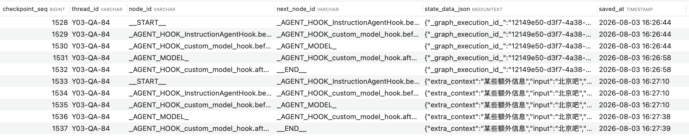

# 上下文管理

Yumi 基于 LangGraph 的 Checkpoint 机制实现对话上下文管理，支持会话级别的上下文隔离、断点续传和智能压缩。

---

## 1. 会话级上下文隔离

每个对话会话拥有独立的上下文空间，通过 `thread_id` 进行隔离，确保不同会话之间的消息互不干扰。


### 核心机制
- **Thread ID 隔离**：每个会话对应唯一的 `thread_id`，上下文数据按线程隔离存储
- **断点续传**：基于  Checkpoint 机制，支持会话状态保存和恢复
- **多会话并行**：用户可同时维护多个对话会话，上下文互不影响

---

## 2. 数据存储结构

上下文数据存储在 `GRAPH_CHECKPOINT` 表中，记录每个检查点的状态信息。

### 查询语句

```sql
SELECT 
    c.`checkpoint_seq`,
    c.`thread_id`,
    c.`node_id`,
    c.`next_node_id`,
    c.`state_data_json`,
    c.`saved_at` 
FROM GRAPH_CHECKPOINT c 
ORDER BY c.`checkpoint_seq` ASC;
```



### 字段说明

| 字段名 | 说明 |
|--------|------|
| `checkpoint_seq` | 检查点序列号，自增标识 |
| `thread_id` | 线程 ID，对应会话标识 |
| `node_id` | 当前执行的节点 ID |
| `next_node_id` | 下一个待执行节点 ID |
| `state_data_json` | 状态数据，包含消息历史等上下文信息（JSON 格式） |
| `saved_at` | 保存时间戳 |

---

## 3. 上下文压缩

当对话历史过长时，系统会自动触发上下文压缩，减少 Token 消耗，同时保留关键上下文信息。

### 压缩策略

- **触发时机**：每次调用大模型前，如果消息总 Token 数超过阈值则触发摘要压缩
- **保留规则**：
  - 第一条消息（系统提示词）不压缩
  - 第二条消息（用户原始诉求）不压缩
  - 工具调用和响应保持完整，不会被拆分，避免上下文断裂
- **压缩格式**：压缩后的消息以系统消息形式插入，结构如下：

```
系统提示词（system）
+ 用户原始消息（user）
+ 历史摘要（system）
+ 最新 N 轮消息（user/assistant/tool）
```

### 代码配置

```java
SummarizationHook summarizationHook = SummarizationHook.builder()
    .model(chatModel)                          // 用于生成摘要的模型
    .maxTokensBeforeSummary(3000)              // 触发压缩的 Token 阈值
    .messagesToKeep(20)                        // 保留的最新消息数量
    .build();
hooks.add(summarizationHook);
```

### 参数说明

| 参数 | 说明 | 默认值 |
|------|------|--------|
| `model` | 用于生成摘要的大模型 | - |
| `maxTokensBeforeSummary` | 触发压缩的 Token 阈值 | 3000 |
| `messagesToKeep` | 压缩后保留的最新消息轮数 | 20 |


### 压缩效果

- **降低 Token 消耗**：有效减少长对话的 API 调用成本
- **保持上下文连贯**：摘要保留关键信息，确保 AI 理解对话脉络
- **工具调用完整**：工具调用和响应保持配对，避免上下文断裂导致执行错误