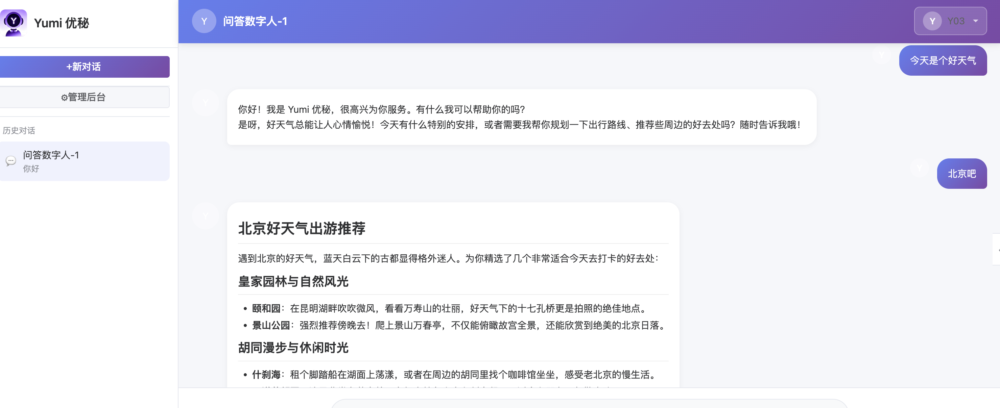
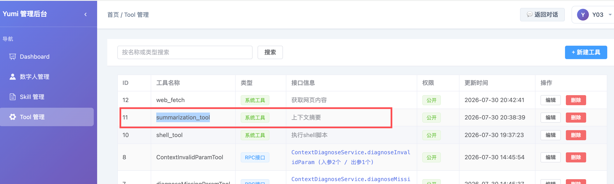

1、一个对话一个上下文 

2、数据层面

查询语句  

select c.`checkpoint_seq`,c.`thread_id`,c.`node_id`,c.`next_node_id`,c.`state_data_json`,c.`saved_at` from GRAPH_CHECKPOINT c order by c.`checkpoint_seq` asc ;

3、上下文压缩
